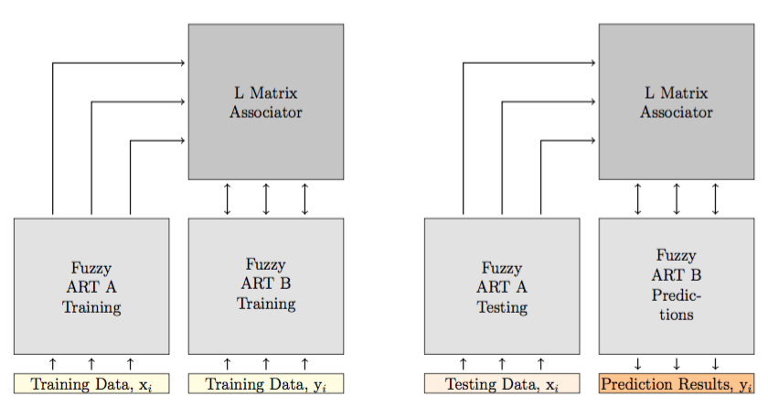

Overview
========

The LAPART neural networks couple two Fuzzy ART algorithms to create a mechanism for making 
predictions based on learned associations. The coupling of the two Fuzzy ARTs has a unique 
stability that allows the system to converge rapidly towards a clear solution. Additionally, 
it can perform logical inference and supervised learning similar to fuzzy ARTMAP.

.. _fig-lapart1:

   
   LAPART training (shown on the left side) uses two Fuzzy ART (A&B) algorithms connected by an associator matrix (L).
   During training inputs x\ :sub:'i'\ are applied to the A-Side while yi inputs are presented ot the B side.
   The algorithm then produces templates and an L matrix.  The testing processes (shown on the right side) 
   has the same structure as the training but applies previously unseen testing data (xi) to the A-Side.
   The algorithm then produces outputs on the B-Side that are the prediction results.
   
Architecture
^^^^^^^^^^^^
The general layout of the LAPART algorithm includes two fuzzy ARTs, labeled as A and B, that 
are connected by an associator matrix referred to as L. These two Fuzzy ARTs are very similar 
to the algorithms described in Section 4.1.1. Each of them have an input layer, a recognition 
layer, and a categorization layer. Also, they both have a vigilance parameter ⇢A,⇢B respectively. 
The A and B algorithms are connected together by an inference mechanism so that the template 
connections are established during training and then used to provide predictions during testing. 
The flow of the algorithm is shown in Figure 4.10. During training, the system is able to learn 
through the presentation of input pattern pairs (IA{x1..xn} and IB{y1..yn}) applied to each 
Fuzzy ART network [48]. At the same time, interconnections between classes are formed in the L 
matrix. The interconnections between the A and B Fuzzy ART connect the learned categories and 
allow for predictions to be made in the testing phase when new data becomes available. During 
testing, as shown in Figure 4.11, previously unseen data are presented to the A side only. 
Categorization of the input patterns occurs in the A side which connects, through the L matrix, 
to a particular category on the B side. The particular B side category for the input pattern is 
then the prediction for the given A input.

   
.. _fig-lapart2:
.. figure:: figures/lapart2.png
   :scale: 75 %
   :alt: Sample-graphics
   
   LAPART training algorithm flow diagram includes Fuzzy ART A & B and two cases for learning A and B side templates.